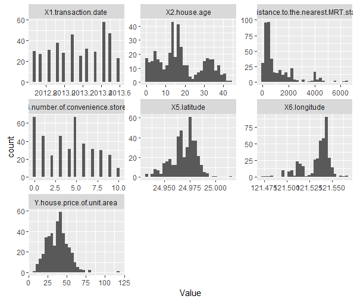
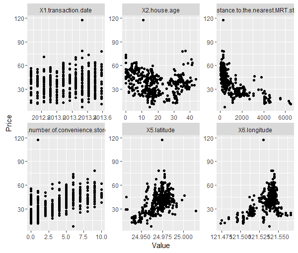
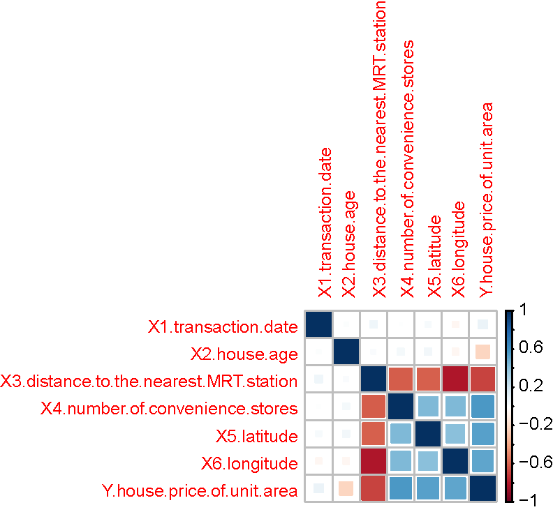
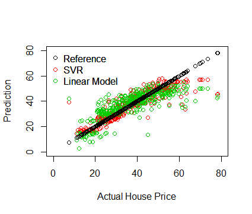

## Simple Model for Real Estate Valuations in Sindian (Aug 2012 - July 2013)

Transaction records for real estate in Sindian for a 1  year period between Aug 2012 and Jul 2013 have been analyzed for the following plots and models.

### Data Cleaning

Data was imported into R and checked. No missing or NaN values were observed. Data seems fairly clean and no further manipulation was implemented. The dataset is fairly small, with 414 observations of 7 variables in total.

### Exploratory Data Analysis

|  | 
|:--:| 
| **Histograms of Variables** |

Transaction data seems fairly clean and well-distributed in time (from Panel 1).
The latitude and longitude values are fairly tight within a range of about 0.1 degree, with no extreme outliers, which is a good sanity check for the data, since they should all be located geographically close together (in Sindian).
Similarly, the number of convenience stores are all integers, with no obvious issues with the data.

The House price variable is fairly normal in distribution, with a small number of outliers on the high end (>100), however, without understanding more, this data point is not ignored for now.

|  | 
|:--:| 
| **Dot Plots of Variables** |

The House Prices are then plotted as dot plots versus the individual X variables in the panels. 
There appears to be a pretty strong inverse relationship with distance from the MRT station, and a clear linear relationship between average price and the number of convenience stores, which is consistent with our own intuition.
Surprisingly, the latitude and longitude values appear to be varying quite linearly with the price as well, although there is greater spread at larger latitudes and longitudes.
The relationship between age and price appears to be much more complicated, although there seems to be a bias towards much older or much newer housing, which is somewhat surprising, since one would expect newer housing to be more expensive. 

|  | 
|:--:| 
| **Correlation Plots of Variables** |

Consistent with our observation above, the House Prices are basically not correlated with the transaction dates, and only weakly correlated with the age. In addition, it's very negatively correlated with distance to the nearest MRT station, and very strongly positively correlated with the remaining variables. 

### Prediction Models

Due to the sparsity of data, I have chosen to use two simple regression models to model the data. Since the prediction value looks fairly normal, I think a typical RMSE metric is sufficient for evaluation of these models.

Based on the previous visualizations, I believe transaction date to be a bad feature, and have only included the other variables in the model. No further feature engineering was employed.

I thus only account for the influence of the following factors on housing prices:
1. Age of the unit
2. Number of convenience stores nearby
3. Distance to nearest MRT station
4. Latitude and Longitude of the unit

We obtain an RMSE of 8.9 for a linear model based simply on these variables. The final equation for a linear model is:

House Price = 42.6 - 0.27 * House Age - 0.004 * Distance to MRT + 1.16 * Number of Convenience Stores + 19.6 * Latitude

All variables are statistically significant except longitude.

From here, we conclude that the impact of number of convenience stores nearby is large, with an average increase of **1.16 per additional store**, while age and distance from MRT can be very detrimental, with the unit losing an average of **0.27 every year that it ages** and **0.004 for every additional metre from the nearest MRT**.

Nonetheless, the linear model assumes linearity in the dependence on the variables specified, but it is clear from the previous graphs that these relationships may be non-linear. Hence, a radial basis function (rbf) kernel based regression method is used (support vector regression). 

Indeed, running the support vector regression (SVR) model already allows us to reduce the RMSE from 8.9 to 7.3 with the default settings.

##### Parameter Optimization

There are additional hyper-parameters that need to be tuned for SVR: the cost and epsilon parameters. Further tuning of these parameters via a simple grid search algorithm and 10-fold cross-validation allow us to further reduce the RMSE to 7.02 from 7.32.

Nonetheless, this is a substantial improvement in predictive capability from the linear model's 8.9

|  | 
|:--:| 
| **Dot Plots of Predictions from Regression Models** |

The predicted House Prices are then plotted as dot plots versus the actual prices for both models. 
The linear model is clearly not as good as the SVR model, however, it is also clear that both models are severely under-predicting for the more expensive prices. More work needs to be done to improve these models for the more expensive units.
